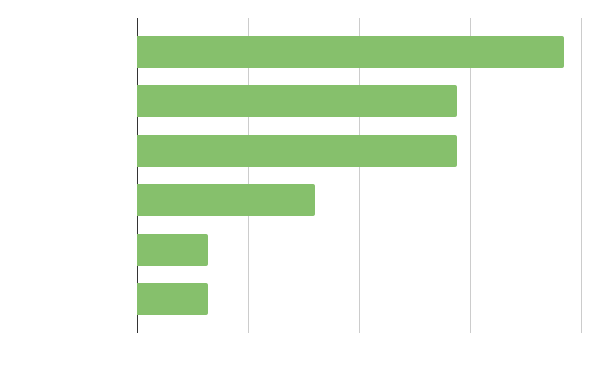
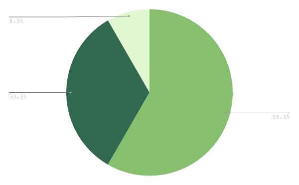
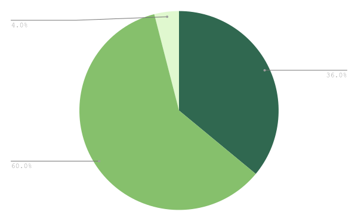
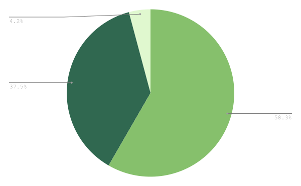

# Game Jam 2 Results

The [second WASM-4 game jam](https://itch.io/jam/wasm4-v2) is a wrap and the results are in! Thanks
again to all our judges who each took the time to rate all 26 games. Thanks again to
[Wasmer](https://wasmer.io/) for sponsoring a prize fund and helping us with promotion.

The quality of many of the games in this jam were absolutely incredible. It was very difficult to
rank the top entries, and we even had a 3-way tie for 3rd place! After much deliberation, the judges
sorted out the tie to give us our 3rd and 4th place winners. Since it was extremely close with the
tie breaker, I'll be pitching in a small bonus prize for our 5th place winner.

Without further ado, here is the final ranking!

## Winners

**5th place** and $100, [Samurai Revenge](https://krylan.itch.io/samurai-revenge) ([wapm link](https://wapm.io/Krylan/samurai-revenge)) by Krylan!

**4th place** and $250, [Asteroids 3000](https://hitchh1k3r.itch.io/asteroids-3000) ([wapm link](https://wapm.io/hitchh1k3r/asteroids-3000)) by HitchH1k3r!

**3rd place** and $500, [disk-0 MADNESS](https://maxcurzi.itch.io/disk-0-madness) ([wapm link](https://wapm.io/maxcurzi/disk-0-MADNESS)) by maxcurzi!

**2nd place** and $750, [First Flight](https://bootra.itch.io/first-flight) ([wapm link](https://wapm.io/bootra/first-flight)) by bootra!

**1st place** and $1000, [Journey to Entorus](https://jerwuqu.itch.io/journey-to-entorus) ([wapm link](https://wapm.io/JerwuQu/journey-to-entorus)) by JerwuQu!

You can see the full rankings and play all 26 games [here on itch.io](https://itch.io/jam/wasm4-v2/results). Also be sure to check out the per-category rankings.
There were so many great games in this jam, and they all deserve a playthrough and comment. If you
managed to submit a game at all, congratulations! If not, I hope you join us for the next jam!

Also check out all the [WASM-4 games on wapm](https://wapm.io/interface/wasm4), which now has a new
category specifically for WASM-4.

## Developer Survey

As part of the game submission process, we asked developers to fill out a short, optional survey
with some basic questions. Since almost everyone took the time to fill out this survey, we have
enough data to share some interesting graphs about the average WASM-4 developer.

### Programming Language

We asked developers about the programming language they used to build their jam game:

Zig has really taken over! AssemblyScript also had a strong showing, coming out of nowhere after
being almost completely absent from our last jam.

### Interests in WASM-4

We asked developers which aspects of WASM-4 they're interested in:

Unsurprisingly, almost everyone marked the challenge of resource constraints as one of the things
they're interested in. A large number are also marked interest in WebAssembly's future as one of
their reasons for using WASM-4.

### Ages

We asked developers roughly which of these age buckets they fall into:

I was expecting older folks to be more interested in retro tech aesthetics, so it was surprising to
see all the Zoomers! Part of that is likely due to how game jams skew younger in general, but it's
interesting how WASM-4 is being picked up by people who may have never been exposed to the Game Boy
or NES.

### Professions

We asked developers whether they're a student, retired, working in a software field, or working in a
field unrelated to software:

It turns out that building a WASM-4 game is actually kind of technical. The population is skewed
among people who already work in software, or are a student (presumably for a software field).

### Geography

Finally, we asked developers where they live:

With these results, I've decided to switch WASM-4's refresh rate to [50 hz](https://en.wikipedia.org/wiki/PAL) (just kidding).
In all seriousness, we have major work to do in reaching developers outside of Europe and North
America. If you're from a non-English speaking community and reading this, please help us get WASM-4
into more people's hands!

## Thanks!

Thanks everyone involved for participating and helping out with the jam. You are helping to prove
that big things can indeed come in small (.wasm) packages. If you want to keep up to date with
future events and developments around WASM-4, consider joining our small [community](/community) of
retro-minded WASM-heads.
