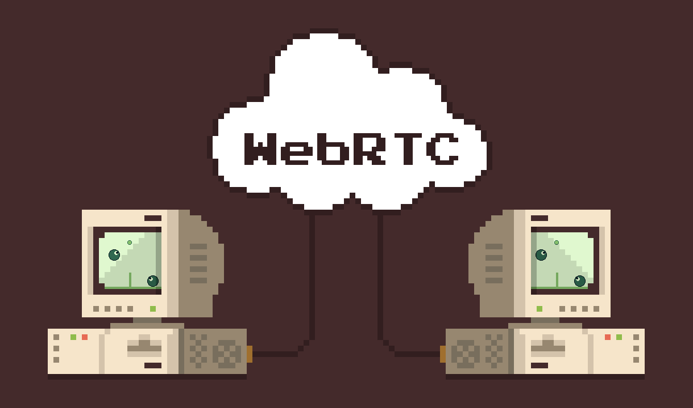

import PlayButton from '@site/src/components/PlayButton';

# Release 2.4: Netplay

The latest version of WASM-4 now supports online multiplayer!

Hosting a netplay game is as easy as copy and pasting a link.

1. While playing any cart, press Enter to open the WASM-4 menu.
2. Select "Copy Netplay URL". An invite link (like `https://wasm4.org/netplay/#ABCDEF`) will be
   copied to your clipboard for you to send to a friend.
4. When your friend clicks your link, they'll instantly join your game as Player 2. **No installation,
   no account creation, no configuration**.

Try it out yourself with these multiplayer games:

    <PlayButton slug="shieldshooter" title="Shieldshooter" author="Marcus Ramse" colWidth="3"/>
    <PlayButton slug="lime-volleyball" title="Lime Volleyball" author="Bruno Garcia" colWidth="3"/>
    <PlayButton slug="wloku" title="WLOKU" author="12Boti" colWidth="3"/>
    <PlayButton slug="racer" title="Racer" author="Claudio Mattera" colWidth="3"/>

Some details about how netplay works in WASM-4:

* Fully peer-to-peer using WebRTC data channels.
* Low-latency [rollback netcode](https://www.youtube.com/watch?v=0NLe4IpdS1w) based on GGPO.
* Works on both desktop and mobile web.
* Supports up to 4 simultaneous players.
* Players can join and leave at any time during gameplay.
* The cart `.wasm` is automatically transferred to other players when they join. This means you can
  host your game anywhere, and even netplay games during development running on localhost.
* No new APIs to learn. All WASM-4 games automatically support netplay. You can build online
  multiplayer games in just a few lines of code!

From the beginning, a goal of WASM-4 has been to unlock powerful technologies like WebAssembly for
the average developer. With this release, we hope to extend that to WebRTC. I'm looking forward to
seeing what people create!

To learn more, check out the [Multiplayer](/docs/guides/multiplayer) documentation.
