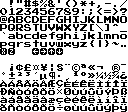

import MultiLanguageCode from '@site/src/components/MultiLanguageCode';

# Fonts

## Charset

The WASM-4 font contains 224 characters total.



Aside from text and symbols, many slots are empty. This is because in UTF-8, the text format used for the `text()` function, doesn't have any character indexed to it. Moreover, some of them *are* mapped, but as control characters.

The `\n`, for example, is technically a character, but it's mapped to mark a line break.

If we look closely at the font, we'll find four arrows and two buttons, highlighted by a circle.
It's possible to print one of these characters by escaping it's charcode.

| Key         | Escape Character |
|-------------|------------------|
| A button    | `\x80`           |
| B button    | `\x81`           |
| Left arrow  | `\x84`           |
| Right arrow | `\x85`           |
| Up arrow    | `\x86`           |
| Down arrow  | `\x87`           |

We could use those as instructions for our games!

<!-- <MultiLanguageCode> -->

```typescript
// Press UP to jump!
w4.text("Press \x86 to jump!", 10, 10);
```

<!-- </MultiLanguageCode> -->

## Custom Fonts

Since WASM-4 doesn't have a custom font, we have to figure a way to implement our own. One way to approach this is treating a font like a tilemap, except we're indexing characters instead of numbers!

The example below will print a text using the [BitScript sprite font](https://opengameart.org/content/bitscript-a-low-res-handwriting-font):

<!-- <MultiLanguageCode> -->

```typescript
import * as w4 from "./wasm4";

const fontWidth = 208;
const fontHeight = 8;
const fontFlags = w4.BLIT_1BPP;
const charWidth = 8;
const charHeight = 8;
const charset = "ABCDEFGHIJKLMNOPQRSTUVWXYZ";
const font = memory.data<u8>([
  0x00, 0x00, 0x00, 0x00, 0x00, 0x00, 0x00, 0x00,
  0x00, 0x00, 0x00, 0x00, 0x00, 0x00, 0x00, 0x00,
  0x00, 0x00, 0x00, 0x00, 0x00, 0x00, 0x00, 0x00,
  0x00, 0x00, 0x08, 0x1c, 0x1c, 0x3c, 0x18, 0x3e,
  0x1c, 0x26, 0x10, 0x2c, 0x12, 0x08, 0x24, 0x26,
  0x1c, 0x3c, 0x1c, 0x78, 0x1c, 0x3c, 0x62, 0x42,
  0x82, 0xc4, 0x42, 0x66, 0x08, 0x32, 0x22, 0x52,
  0x24, 0x51, 0x22, 0x25, 0x28, 0x14, 0x14, 0x08,
  0x24, 0x26, 0x22, 0x52, 0x22, 0xa4, 0x22, 0x52,
  0x22, 0xa5, 0x44, 0x2a, 0x24, 0x1c, 0x14, 0x52,
  0x20, 0x12, 0x20, 0x10, 0x20, 0x26, 0x28, 0x04,
  0x14, 0x08, 0x2c, 0x24, 0x22, 0x52, 0x22, 0xa4,
  0x20, 0x10, 0x22, 0x24, 0x54, 0x10, 0x24, 0x04,
  0x14, 0x5c, 0x40, 0x22, 0x38, 0x38, 0x4e, 0x7c,
  0x28, 0x08, 0x28, 0x10, 0x54, 0x58, 0x42, 0x14,
  0x44, 0x78, 0x18, 0x10, 0x24, 0x28, 0x54, 0x10,
  0x14, 0x08, 0x24, 0xa4, 0x40, 0x62, 0x40, 0x20,
  0x44, 0x48, 0x10, 0x08, 0x34, 0x30, 0x54, 0x48,
  0x44, 0x20, 0x54, 0x48, 0x04, 0x20, 0x44, 0x28,
  0x2c, 0x28, 0x08, 0x10, 0x3c, 0xa4, 0x42, 0xa4,
  0x44, 0xa0, 0x44, 0xc9, 0x10, 0x48, 0x24, 0x52,
  0x44, 0x4a, 0x44, 0xa0, 0x3a, 0x48, 0x44, 0xa0,
  0x44, 0x10, 0x28, 0xa8, 0x48, 0x38, 0x42, 0x5b,
  0x3c, 0x58, 0x38, 0x40, 0x38, 0x46, 0x68, 0x34,
  0x42, 0x2c, 0x82, 0x84, 0x3a, 0x40, 0x08, 0x86,
  0x38, 0x40, 0x3a, 0x10, 0x48, 0x46, 0x30, 0x66
]);
function write(text: string, x: i32, y: i32, colors: u16): void {
    // Set draw colors...
    store<u16>(w4.DRAW_COLORS, colors);

    // Line and column counters.
    let line  : i32 = 0;
    let column: i32 = 0;

    // Special characters: "\n" (newline) and " " (space).
    const newline: i32 = 10;
    const space  : i32 = 32;

    // Iterate through each character...
    for(let i = 0; i < text.length; i += 1) {
        const char: string = text.charAt(i);
        const charCode: i32 = char.charCodeAt(0);

        // Break into next line when encounter a "\n" (newline)...
        if(charCode === newline) {
            line  += 1;
            column = 0;
            continue;
        }
        // Advance to next column when encounter a " " (space)...
        else if(charCode === space) {
            column += 1;
            continue;
        }

        // Character index on charset.
        let charIndex: i32 = charset.indexOf(char);

        // Skip invalid characters...
        if(charIndex < 0 || charIndex >= charset.length) {
            column += 1;
            continue;
        }

        // Draw character...
        w4.blitSub(
            font,
            x + (column * charWidth),
            y + (line * charHeight),
            charWidth,
            charHeight,
            charIndex * charWidth,
            0,
            fontWidth,
            fontFlags
        );

        // Advance to next column...
        column += 1;
    }
}

export function update (): void {
    write("HELLO WORLD WITH\nOUR CUSTOM FONT", 4, 4, 0x30);
}
```

<!-- </MultiLanguageCode> -->
