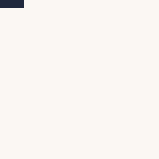

import Tabs from '@theme/Tabs';
import TabItem from '@theme/TabItem';

# Drawing the Snake

## Drawing the body

<Tabs
    groupId="code-language"
    defaultValue="language-typescript"
    values={[
        {label: 'AssemblyScript', value: 'language-typescript'},
        {label: 'C / C++', value: 'language-cpp'},
        {label: 'Rust', value: 'language-rust'},
        {label: 'Go', value: 'language-go'},
    ]}>

<TabItem value="language-typescript">
</TabItem>

<TabItem value="language-cpp">
</TabItem>

<TabItem value="language-rust">
</TabItem>

<TabItem value="language-go">

To draw the snake, you can take advantage of Go's `range` keyword to loop through the body.
To make it a little easier, it's a good idea to use the `Rect` function of WASM-4:

```go
// Rect draws a rectangle. It uses color 1 to fill and color 2 for the outline
func Rect(x, y, width, height int)
```

With that out the way, let's see what a first draft could look like.

```go
func (s *Snake) Draw() {
	for _, part := range s.Body {
		w4.Rect(part.X*8, part.Y*8, 8, 8)
	}
}
```

Simply loop through the body and draw it at `X*8` and `Y*8`. 8 is the width and the height of a single part. On a 160x160 screen, it's big enough to fit snake that is 20*20=400 parts long.

:::note Importing cart/w4
Keep in mind you need to import `cart/w4` in case your editor doesn't do this for you.
:::

That's all fine, but since there is no instance of the snake, nothing can be drawn. To fix this, simply create a new variable in main and call it's draw function:

```diff
package main

import (
	"image"
 
	"cart/w4"
)

+var (
+	snake = &Snake{
+		Body: []image.Point{
+			{X: 2, Y: 0},
+			{X: 1, Y: 0},
+			{X: 0, Y: 0},
+		},
+		Direction: image.Point{X: 1, Y: 0},
+	}
+)
+
//go:export start
func start() {
	w4.PALETTE[0] = 0xfbf7f3
	w4.PALETTE[1] = 0xe5b083
	w4.PALETTE[2] = 0x426e5d
	w4.PALETTE[3] = 0x20283d
}

//go:export update
func update() {
+	snake.Draw()
}
```

Creating a global instance of a snake with some default values.

After that, simply call the "Draw" function of the snake.

You should see some green blocks at the top. 


</TabItem>

</Tabs>

## Drawing the head

<Tabs
    groupId="code-language"
    defaultValue="language-typescript"
    values={[
        {label: 'AssemblyScript', value: 'language-typescript'},
        {label: 'C / C++', value: 'language-cpp'},
        {label: 'Rust', value: 'language-rust'},
        {label: 'Go', value: 'language-go'},
    ]}>

<TabItem value="language-typescript">
</TabItem>

<TabItem value="language-cpp">
</TabItem>

<TabItem value="language-rust">
</TabItem>

<TabItem value="language-go">

But where is the head? You can pick a side. Either position `[0]` or position `[len(snake)-1]`.

I think it's easier to pick `[0]`.

Since the body is drawn, head is not much of a problem. Simply use the `Rect` function again. But use a specific part instead:

```go
	w4.Rect(s.Body[0].X*8, s.Body[0].Y*8, 8, 8)
```

The draw function should now look like this:

```go
func (s *Snake) Draw() {
	for _, part := range s.Body {
		w4.Rect(part.X*8, part.Y*8, 8, 8)
	}

	w4.Rect(s.Body[0].X*8, s.Body[0].Y*8, 8, 8)
}
```

Notice the difference? Me neither.

The head should stand out a little. For this, you can use a different color:

```go
*w4.DRAW_COLORS = 0x0004
```

You can set the colors with this variable. You can look at this variable like a table that is read from right to left.

The value for each digit can be  0 up to 4:

- 0 = Use transparency
- 1 = Use the 1st color from the color palette 
- 2 = Use the 2nd color from the color palette 
- 3 = Use the 3rd color from the color palette
- 4 = Use the 4th color from the color palette

The snippet above reads like this: "Color 1 uses Color 4 of the color palette, Color 2 to Color 4 don't use any color." The basic drawing functions use "Color 1" to fill the shape and "Color 2" for the border.

If you change the source to

```go
func (s *Snake) Draw() {
	for _, part := range s.Body {
		w4.Rect(part.X*8, part.Y*8, 8, 8)
	}

	*w4.DRAW_COLORS = 0x0004
	w4.Rect(s.Body[0].X*8, s.Body[0].Y*8, 8, 8)
}
```

Result:



You'll see a change. The snake changed color. Not only the head, but the complete snake! Once you've set a color, it stays that way. So if you want to change only the head, you have to change Color 1 again. Right before you draw the body.

```diff
func (s *Snake) Draw() {
+	*w4.DRAW_COLORS = 0x0043
	for _, part := range s.Body {
		w4.Rect(part.X*8, part.Y*8, 8, 8)
	}

	*w4.DRAW_COLORS = 0x0004
	w4.Rect(s.Body[0].X*8, s.Body[0].Y*8, 8, 8)
}
```

This changes the color back and adds the darker green as it's outline.


</TabItem>

</Tabs>
