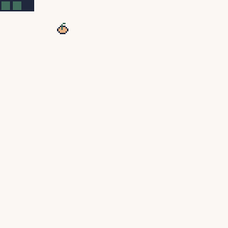

# Inspiration & Goals

Snake is a simple game. You can implement it in pretty any language or engine. It also allows for real-time user interaction and is a challenging game in itself.

## Goals

And the end of the tutorial, you will have a working version of snake.  
You can expand on it and make your very own version along the way.

During this tutorial you will learn how to ...

- ... change the color palette
- ... pick a color to draw
- ... draw primitives (rectangles)
- ... convert a sprite-image to source and draw it
- ... handle user input
- ... publish your game

## Preview

At the end of this tutorial, your snake game will look like this:

