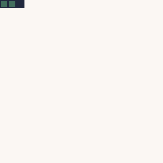

import Tabs from '@theme/Tabs';
import TabItem from '@theme/TabItem';

# Handling User Input

With a moving snake, you've done a good part of the game. This part lets you give the control into the players hands. If the player presses a certain button, you just have to change the values of the "Direction"-Property of your snake.

That's it.

But first, you need to understand how WASM-4 handles it's user input.

## Gamepad Basics

WASM-4 provides 4 variables that represent the current state of the respective gamepad. It's `0` (Zero) if nothing is pressed right now. Otherwise it contains a sum of those values:

| Button   | Value |
|----------|:-----:|
| Button 1 | 1     |
| Button 2 | 2     |
| Left     | 16    |
| Right    | 32    |
| Up       | 64    |
| Down     | 128   |

So if the player presses "Right" and "Button 1", the value would be 33. Now are all values "a power of two", meaning you can set and check them using binary operators.

If you want to check if Button 1 is pressed, simply use the binary AND:

This is true for all other buttons too.

## Keyboard Layout

For the player side of things, WASM-4 tries to cover most keyboard layouts:

- X and Space = Button 1
- Y, C and Z = Button 2

This should cover QWERTY, QWERTZ and Dvorak layouts.

The gamepads for the players 2, 3 and 4 are currently not implemented.

## Detecting `justPressed`

Since the current state of the gamepad is stored in a single variable, you need to compare it to the previous state.

You can achieve this by using the bitwise XOR operator. To make it short, here is the code snippet you can use:

<Tabs
    groupId="code-language"
    defaultValue="language-typescript"
    values={[
        {label: 'AssemblyScript', value: 'language-typescript'},
        {label: 'C / C++', value: 'language-cpp'},
        {label: 'Rust', value: 'language-rust'},
        {label: 'Go', value: 'language-go'},
    ]}>

<TabItem value="language-typescript">

```typescript
const gamepad = load<u8>(w4.GAMEPAD1);
const justPressed = gamepad & (gamepad ^ prevState)
```

The constant `justPressed` now holds all buttons that were pressed this frame. You can check the state of a single button like this:

```go
if (justPressed & w4.BUTTON_UP) {
	// Do something
}
```

</TabItem>

<TabItem value="language-cpp">

// TODO

</TabItem>

<TabItem value="language-rust">

// TODO

</TabItem>

<TabItem value="language-go">

```go
justPressed := *w4.GAMEPAD1 & (*w4.GAMEPAD1 ^ prevState)
```

The variable `justPressed` now holds all buttons that were pressed this frame. You can check the state of a single button like this:

```go
if justPressed&w4.BUTTON_UP != 0 {
	// Do something
}
```

</TabItem>

</Tabs>

If you don't care *why* that is, [skip to the next part](#changing-directions).

Like I explained in "Gamepad Basics", the value of Gamepad 1 is a combination of all currently pressed buttons. If we store it and use XOR or later on, we only get the differences.

Let's assume the right button is currently pressed. In that case Gamepad 1 has the value 32 (Right = 32). Now the player presses Button 1. The value changes from 32 to 33 (Button 1 + Right = 1 + 32 = 33). By using XOR, we get 1 as a result.

In the next step, we compare it to the current state. Like: What buttons are *new* this frame.

Here's a "hands-on" example:

```
Frame 0: Gamepad1 = 0 (No buttons are pressed)
Frame 1: Gamepad1 = 32 (Right button is pressed)

Difference between Frame 0 and 1:
  00000000 (0)
^ 00100000 (32)
= 00100000 (32)

What's new:
  00100000 (32)
& 00100000 (32)
= 00100000 (32)

Result: "32" is new

----

Frame 2: Gamepad1 = 33 (Right button and Button 1 are pressed)

Differences between Frame 1 and 2:
  00100000 (32)
^ 00100001 (33)
= 00000001 (1)

What's new:
  00000001 (1)
& 00100001 (33)
= 00000001 (1)

Result: "1" is new

----

Frame 3: Gamepad1 = 1 (Button 1 is pressed, Right button got released)

Difference between Frame 2 and 3:
  00100001 (33)
^ 00000001 (1)
= 00100000 (32)

What's new:
  00100000 (32)
& 00000001 (1)
= 00000000 (0)

Result: No new key was pressed this frame.

```

## Changing Directions

Now that you know how to detect if a key was pressed in the current frame, it's time you let the player change the direction of the snake.

Like most of this tutorial, this is step is rather easy once you've grasped how it works.

For this, you need to change the update function of in the main file. Remember, this is how it currently looks like:

<Tabs
    groupId="code-language"
    defaultValue="language-typescript"
    values={[
        {label: 'AssemblyScript', value: 'language-typescript'},
        {label: 'C / C++', value: 'language-cpp'},
        {label: 'Rust', value: 'language-rust'},
        {label: 'Go', value: 'language-go'},
    ]}>

<TabItem value="language-typescript">

```typescript
export function update(): void {
  frameCount++

  if (frameCount % 15 == 0) {
    snake.update()
  }

  snake.draw()
}
```

</TabItem>

<TabItem value="language-cpp">

// TODO

</TabItem>

<TabItem value="language-rust">

// TODO

</TabItem>

<TabItem value="language-go">

```go
//go:export update
func update() {
	frameCount++

	if frameCount%15 == 0 {
		snake.Update()
	}

	snake.Draw()
}
```

</TabItem>

</Tabs>

The classic processing loop goes like this: Input, Process the input, output the result. Or in case of most games: User-Input, Update, Render. The last two steps are already in place. Now it's time to add the first part.

<Tabs
    groupId="code-language"
    defaultValue="language-typescript"
    values={[
        {label: 'AssemblyScript', value: 'language-typescript'},
        {label: 'C / C++', value: 'language-cpp'},
        {label: 'Rust', value: 'language-rust'},
        {label: 'Go', value: 'language-go'},
    ]}>

<TabItem value="language-typescript">

It's a good idea to handle the input in it's own function. Something like this could be on your mind:

```typescript {1-8,13}
function input(): void {
  const gamepad = load<u8>(w4.GAMEPAD1);
  const justPressed = gamepad & (gamepad ^ prevState)

  if (justPressed & w4.BUTTON_UP) {
    // Do something
  }
}

export function update(): void {
  frameCount++

  input()

  if (frameCount % 15 == 0) {
    snake.update()
  }

  snake.draw()
}
```

If you try to compile this, you should get an error: `ERROR TS2304: Cannot find name 'prevState'.`. This is easily fixed. Just place the prevState into the var-section:

```typescript {2}
const snake = new Snake()
let prevState: u8
let frameCount = 0
```

To notice any change in the gamepad, you have to store the *current state* at the end of the input. This will make it the *previous state*. And while you're at it, why not add the other 3 directions along the way:

```typescript {8-18}
function input(): void {
  const gamepad = load<u8>(w4.GAMEPAD1);
  const justPressed = gamepad & (gamepad ^ prevState)

  if (justPressed & w4.BUTTON_LEFT) {
    // Do something
  }
  if (justPressed & w4.BUTTON_RIGHT) {
    // Do something
  }
  if (justPressed & w4.BUTTON_UP) {
    // Do something
  }
  if (justPressed & w4.BUTTON_DOWN) {
    // Do something
  }

  prevState = gamepad
}
```

If you want to check if it works: Use the `trace` function provided by WASM-4. Here's an example:

```typescript
  if (justPressed & w4.BUTTON_DOWN) {
    w4.trace("Down")
  }
```

If you use `trace` in each if-statement, you should see the corresponding output in the console.

Now, instead of using `trace` to confirm everything works as intended, you should replace it with something like this:

```typescript
  if (justPressed & w4.BUTTON_DOWN) {
    snake.down()
  }
```

I'll leave it to you, to finish the other 3 directions.

You'll be - once again - rewarded with error messages:

```
ERROR TS2339: Property 'up' does not exist on type 'src/snake/Snake'.
ERROR TS2339: Property 'down' does not exist on type 'src/snake/Snake'.
ERROR TS2339: Property 'left' does not exist on type 'src/snake/Snake'.
ERROR TS2339: Property 'right' does not exist on type 'src/snake/Snake'.
```

To fix this, add those functions to your snake. Here's an example for `down`:

```typescript
  down(): void {
    if (this.direction.y == 0) {
      this.direction.x = 0
      this.direction.y = 1
    }
  }
```

</TabItem>

<TabItem value="language-cpp">

// TODO

</TabItem>

<TabItem value="language-rust">

// TODO

</TabItem>

<TabItem value="language-go">

It's a good idea to handle the input in it's own function. Something like this could be on your mind:

```go {1-7,13}
func input() {
	justPressed := *w4.GAMEPAD1 & (*w4.GAMEPAD1 ^ prevState)

	if justPressed&w4.BUTTON_UP != 0 {
		// Do something
	}
}

//go:export update
func update() {
	frameCount++

	input()

	if frameCount%15 == 0 {
		snake.Update()
	}

	snake.Draw()
}
```

If you try to compile this, you should get an error: `undeclared name: prevState`. This is easily fixed. Just place the prevState into the var-section:

```go {11}
var (
	snake = &Snake{
		Body: []Point{
			{X: 2, Y: 0},
			{X: 1, Y: 0},
			{X: 0, Y: 0},
		},
		Direction: Point{X: 1, Y: 0},
	}
	frameCount = 0
	prevState  uint8
)
```

To notice any change in the gamepad, you have to store the *current state* at the end of the input. This will make it the *previous state*. And while you're at it, why not add the other 3 directions along the way:

```go {7-17}
func input() {
	justPressed := *w4.GAMEPAD1 & (*w4.GAMEPAD1 ^ prevState)

	if justPressed&w4.BUTTON_UP != 0 {
		// Do something
	}
	if justPressed&w4.BUTTON_DOWN != 0 {
		// Do something
	}
	if justPressed&w4.BUTTON_LEFT != 0 {
		// Do something
	}
	if justPressed&w4.BUTTON_RIGHT != 0 {
		// Do something
	}

	prevState = *w4.GAMEPAD1
}
```

If you want to check if it works: Use the `Trace` function provided by WASM-4. Here's an example:

```go
	if justPressed&w4.BUTTON_DOWN != 0 {
		w4.Trace("Down")
	}
```

If you use `Trace` in each if-statement, you should see the corresponding output in the console.

Now, instead of using `Trace` to confirm everything works as intended, you should replace it with something like this:

```go
	if justPressed&w4.BUTTON_DOWN != 0 {
		snake.Down()
	}
```

I'll leave it to you, to finish the other 3 directions.

You'll be - once again - rewarded with error messages:

```
snake.Up undefined (type *Snake has no field or method Up)
snake.Down undefined (type *Snake has no field or method Down)
snake.Left undefined (type *Snake has no field or method Left)
snake.Right undefined (type *Snake has no field or method Right)
```

To fix this, add those functions to your snake. Here's an example for `Down`:

```go
func (s *Snake) Down() {
	if s.Direction.Y == 0 {
		s.Direction = Point{X: 0, Y: 1}
	}
}
```

</TabItem>

</Tabs>

First, it checks if the direction is already changing the Y-Direction. Only if it isn't allow the change. And then change the Y-Direction to 1. The `Up` direction requires a Y-Direction of `-1`. `Left` and `Right` don't check the Y, but the X and change it accordingly (Left: -1, Right: 1).

With this knowledge, you should be able to implement them. If you're unsure, check the source in the repository.


