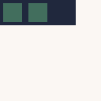
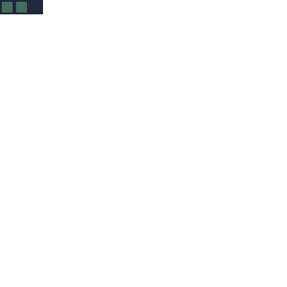

import MultiLanguage, {Page} from '@site/src/components/MultiLanguage';

# Moving the Snake

To move the snake, you have to change the X and Y position of every body-part of the snake.

For this, you can start at the end of the body and give this part the values of the part ahead.
Since the final piece to get its values "stolen" is the head, the head seems to disappear for very brief moment.

After this is done, you simply move the head in the direction of the snake.
Since all of this happens, before the snake is rendered, it appears as a fluid motion.

This is how the logic looks like:



Keep in mind: This is not what the player sees. This is:


## Moving the Body

<MultiLanguage>

<Page value="assemblyscript">

To achieve the first step (moving the body, excluding the head), a simple loop is all you need:

```typescript
    update(): void {
        let body = this.body;
        for (let i = body.length - 1; i > 0; i--) {
            unchecked(body[i].x = body[i - 1].x)
            unchecked(body[i].y = body[i - 1].y)
        }
    }
```

Don't forget to call the new function in the main-loop:

```typescript {2}
export function update(): void {
    snake.update()
    snake.draw()
}
```

Now if you execute this, you'd notice that you can't see much. In fact, you might see the snake for a short moment before the head is all that's left.


</Page>

<Page value="c">

To achieve the first step (moving the body, excluding the head), a for loop is used:

```c
void snake_update(struct snake *snake)
{
    for(int i = (snake->length)-1; i > 0; i--)
    { 
        snake->body[i] = snake->body[i-1];
    }
}
```

Don't forget to call the new function in the main-loop:

```c {3}
void update () 
{
  snake_update(&snake);
  snake_draw(&snake);
}
```

Now if you execute this, you'd notice that you can't see much. In fact, you might see the snake for a short moment before the head is all that's left.


</Page>

<Page value="d">

// TODO

</Page>

<Page value="go">

To achieve the first step (moving the body, excluding the head), a simple loop is all you need:

```go
func (s *Snake) Update() {
	for i := len(s.Body) - 1; i > 0; i-- {
		s.Body[i] = s.Body[i-1]
	}
}
```

Don't forget to call the new function in the main-loop:

```go {3}
//go:export update
func update() {
	snake.Update()

	snake.Draw()
}
```

Now if you execute this, you'd notice that you can't see much. In fact, you might see the snake for a short moment before the head is all that's left.


</Page>

<Page value="nelua">
To achieve the first step (moving the body, excluding the head), a simple loop is all you need:

```lua
function Snake:update()
  for i = #self.body, 2, -1 do
    self.body[i] = self.body[i - 1]
  end
end
```

Don't forget to call the new function in the main-loop:

```lua {2}
local function update()
  snake:update()
  snake:draw()
end
```

Now if you execute this, you'd notice that you can't see much. In fact, you might see the snake for a short moment before the head is all that's left.


</Page>

<Page value="nim">

// TODO

</Page>

<Page value="odin">

// TODO

</Page>

<Page value="porth">

// TODO

</Page>

<Page value="rust">

To achieve the first step (moving the body, excluding the head), we just remove the last body segment.

```rust
// src/snake.rs
    pub fn update(&mut self) -> Option<Point> {
        if self.body.len() > 1 {
            self.body.pop()
        } else {
            None
        }
    }
```

Don't forget to call the new function inside `Game::update`.

```rust {17}
// src/game.rs
use crate::snake::{Point, Snake};
use crate::wasm4;

pub struct Game {
    snake: Snake,
}

impl Game {
    pub fn new() -> Self {
      Self {
          snake: Snake::new(),
      }
    }

    pub fn update(&mut self) {
        self.snake.update();
        self.snake.draw();
    }
}
```

Now if you execute this, you'd notice that you can't see much. In fact, you might see the snake for a short moment before the head is all that's left.


</Page>

<Page value="wat">

To achieve the first step (moving the body, excluding the head), a loop is all you need:

```wasm
(func $snake-update
  (local $offset i32)

  ;; loop backward from the end to the beginning.
  (local.set $offset
    (i32.mul
      (i32.sub (i32.load (i32.const 0x19a8)) (i32.const 1))
      (i32.const 8)))

  (loop $loop
    ;; body[i].x = body[i - 1].x
    ;;
    ;; The - 8 offset is baked into the i32.load offset.
    (i32.store offset=0x19ac
      (local.get $offset)
      (i32.load offset=0x19a4 (local.get $offset)))

    ;; body[i].y = body[i - 1].y
    (i32.store offset=0x19b0
      (local.get $offset)
      (i32.load offset=0x19a8 (local.get $offset)))

    (br_if $loop
      (i32.gt_s
        (local.tee $offset (i32.sub (local.get $offset) (i32.const 8)))
        (i32.const 0))))
)
```

Don't forget to call the new function in the main-loop:

```wasm
(func (export "update")
  (call $snake-update)
  (call $snake-draw)
)
```

Now if you execute this, you'd notice that you can't see much. In fact, you might see the snake for a short moment before the head is all that's left.


</Page>

<Page value="zig">
To achieve the first step (moving the body, excluding the head), a simple loop is all you need:

```zig
    pub fn update(this: *@This()) void {
        const part = this.body.slice();
        var i: usize = part.len - 1;
        while (i > 0) : (i -= 1) {
            part[i].x = part[i - 1].x;
            part[i].y = part[i - 1].y;
        }
    }
```

Don't forget to call the new function in the main-loop:

```zig {2}
export fn update() void {
    snake.update();
    snake.draw();
}

```

Now if you execute this, you'd notice that you can't see much. In fact, you might see the snake for a short moment before the head is all that's left.


</Page>

</MultiLanguage>

## Moving the Head

<MultiLanguage>

<Page value="assemblyscript">

This isn't hard either. Simple add the add the direction to the current head. And then make sure the head stays within the boundaries:

```typescript {8-16}
    update(): void {
        let body = this.body;
        for (let i = body.length - 1; i > 0; i--) {
            unchecked(body[i].x = body[i - 1].x)
            unchecked(body[i].y = body[i - 1].y)
        }

        body[0].x = (body[0].x + this.direction.x) % 20
        body[0].y = (body[0].y + this.direction.y) % 20

        if (body[0].x < 0) {
            body[0].x = 19
        }
        if (body[0].y < 0) {
            body[0].y = 19
        }
    }
```

</Page>

<Page value="c">

To move the head we need to add the direction to the current head. And then make sure the head stays within the boundaries:

```c {8-18}
void snake_update(struct snake *snake)
{
    for(int i = (snake->length)-1; i > 0; i--)
    { 
        snake->body[i] = snake->body[i-1];
    }

    snake->body[0].x = (snake->body[0].x + snake->direction.x) % 20;
    snake->body[0].y = (snake->body[0].y + snake->direction.y) % 20;
     
    if(snake->body[0].x < 0)
    {
        snake->body[0].x = 19;
    }
    if(snake->body[0].y < 0)
    {
        snake->body[0].x = 19;
    }
}
```

</Page>

<Page value="d">

// TODO

</Page>

<Page value="go">

This isn't hard either. Simple add the add the direction to the current head. And then make sure the head stays within the boundaries:

```go {6-13}
func (s *Snake) Update() {
	for i := len(s.Body) - 1; i > 0; i-- {
		s.Body[i] = s.Body[i-1]
	}

	s.Body[0].X = (s.Body[0].X + s.Direction.X) % 20
	s.Body[0].Y = (s.Body[0].Y + s.Direction.Y) % 20
	if (s.Body[0].X < 0) {
		s.Body[0].X = 19
	}
	if (s.Body[0].Y < 0) {
		s.Body[0].Y = 19
	}
}
```

</Page>

<Page value="nelua">

This isn't hard either. Simple add the add the direction to the current head. And then make sure the head stays within the boundaries:

```lua {6-14}
function Snake:update()
  for i = #self.body, 2, -1 do
    self.body[i] = self.body[i - 1]
  end

  self.body[1].x = (self.body[1].x + self.direction.x) % 20
  self.body[1].y = (self.body[1].y + self.direction.y) % 20

  if self.body[1].x < 0 then
    self.body[1].x = 19
  end
  if self.body[1].y < 0 then
    self.body[1].y = 19
  end
end
```

</Page>

<Page value="nim">

// TODO

</Page>

<Page value="odin">

// TODO

</Page>

<Page value="porth">

// TODO

</Page>

<Page value="rust">

This isn't hard either. Simple insert at `0` the new head position and then make sure the head stays within the boundaries:

```rust
// src/snake.rs
    pub fn update(&mut self) -> Option<Point> {
        self.body.insert(
            0,
            Point {
                x: (self.body[0].x + self.direction.x) % 20,
                y: (self.body[0].y + self.direction.y) % 20,
            },
        );

        if self.body[0].x < 0 {
            self.body[0].x = 19;
        }

        if self.body[0].y < 0 {
            self.body[0].y = 19;
        }

        self.body.pop()
    }
```

</Page>

<Page value="wat">

This isn't hard either. Simply add the add the direction to the current head. And then make sure the head stays within the boundaries:

```wasm
(func $snake-update
  (local $body-x i32)
  (local $body-y i32)

  ...

  ;; body[0].x = (body[0].x + direction.x) % 20
  (i32.store
    (i32.const 0x19ac)
    (local.tee $body-x
      (i32.rem_s
        (i32.add
          (i32.load (i32.const 0x19ac))
          (i32.load (i32.const 0x19a0)))
        (i32.const 20))))

  ;; body[0].y = (body[0].y + direction.y) % 20
  (i32.store
    (i32.const 0x19b0)
    (local.tee $body-y
      (i32.rem_s
        (i32.add
          (i32.load (i32.const 0x19b0))
          (i32.load (i32.const 0x19a4)))
        (i32.const 20))))

  ;; if (body[0].x < 0) body[0].x = 19;
  (if (i32.lt_s (local.get $body-x) (i32.const 0))
    (then
      (i32.store (i32.const 0x19ac) (i32.const 19))))

  ;; if (body[0].y < 0) body[0].y = 19;
  (if (i32.lt_s (local.get $body-y) (i32.const 0))
    (then
      (i32.store (i32.const 0x19b0) (i32.const 19))))
)
```

</Page>

<Page value="zig">

This isn't hard either. Simple add the add the direction to the current head. And then make sure the head stays within the boundaries:

```zig {9-13}
    pub fn update(this: *@This()) void {
        const part = this.body.slice();
        var i: usize = part.len - 1;
        while (i > 0) : (i -= 1) {
            part[i].x = part[i - 1].x;
            part[i].y = part[i - 1].y;
        }

        part[0].x = @mod((part[0].x + this.direction.x), 20);
        part[0].y = @mod((part[0].y + this.direction.y), 20);
    }
```

</Page>

</MultiLanguage>

That's it. Now you should see the snake running from left to right. Maybe a little too fast, though.




## Slowing Down

By default WASM-4 runs at 60 FPS. This means your little snake moves 60 fields in each second. That is 3 times the whole screen.
There are several ways to slow the snake down.

The easiest way is probably to count the frames and update the snake only every X frames.

<MultiLanguage>

<Page value="assemblyscript">

For this, you'd need a new variable. You can call it whatever you like, just be sure you know what its purpose is.

```typescript {2}
const snake = new Snake()
let frameCount = 0
```

This variable in main.ts keeps track of all frames so far. Just increase its value in the main-update function:

```typescript {2}
export function update(): void {
    frameCount++

    snake.update()

    snake.draw()
}
```

Now all you need is to check if the passed frames are dividable by X:

```typescript {4-6}
export function update(): void {
    frameCount++

    if (frameCount % 15 == 0) {
        snake.update()
    }

    snake.draw()
}
```

That's it. Your snake should be quite a bit slower now. This reduces the snake from 60 units per second to 4 units per second (60/15 = 4).


</Page>

<Page value="c">

For this, a new variable `frame_count` is needed. Add this at the top of `main.c` and initialize it to `0`:

```c {6}
#include "wasm4.h"
#include "snake.h"
#include <stdlib.h>

struct snake snake;
int frame_count = 0;
```

This variable keeps track of all frames so far. Just increase its value in the update function:

```c {3}
void update () 
{
    frame_count++;
    snake_update(&snake);
    snake_draw(&snake);
}
```

Now add a check to see if the current frame is divisible by 15, and only updates the movement four times per second instead of 60:

```c {4-7}
void update () 
{
    frame_count++;
    if(frame_count % 15 == 0)
    {
      snake_update(&snake);
    }
    snake_draw(&snake);
}
```

That's it. Your snake should be quite a bit slower now. This reduces the snake from 60 units per second to 4 units per second (60/15 = 4).


</Page>

<Page value="d">

// TODO

</Page>

<Page value="go">

For this, you'd need a new variable. You can call it whatever you like, just be sure you know what its purpose is.

```go {10}
var (
	snake = &Snake{
		Body: []Point{
			{X: 2, Y: 0},
			{X: 1, Y: 0},
			{X: 0, Y: 0},
		},
		Direction: Point{X: 1, Y: 0},
	}
	frameCount = 0
)
```

This variable in main.go keeps track of all frames so far. Just increase its value in the main-update function:

```go {3}
//go:export update
func update() {
	frameCount++

	snake.Update()

	snake.Draw()
}
```

Now all you need is to check if the passed frames are dividable by X:

```go {5-7}
//go:export update
func update() {
	frameCount++

	if frameCount%15 == 0 {
		snake.Update()
	}

	snake.Draw()
}
```

That's it. Your snake should be quite a bit slower now. This reduces the snake from 60 units per second to 4 units per second (60/15 = 4).


</Page>

<Page value="nelua">

For this, you'd need a new variable. You can call it whatever you like, just be sure you know what its purpose is.

```lua {2}
local snake = Snake.init()
local frame_count = 0
```

This variable in main.nelua keeps track of all frames so far. Just increase its value in the main-update function:

```lua {2}
local function update()
  frame_count = frame_count + 1
  snake:update()
  snake:draw()
end
```

Now all you need is to check if the passed frames are dividable by X:

```lua {4-6}
local function update()
  frame_count = frame_count + 1

  if frame_count % 15 == 0 then
    snake:update()
  end

  snake:draw()
end
```

That's it. Your snake should be quite a bit slower now. This reduces the snake from 60 units per second to 4 units per second (60/15 = 4).


</Page>

<Page value="nim">

// TODO

</Page>


<Page value="odin">

// TODO

</Page>

<Page value="porth">

// TODO

</Page>

<Page value="rust">

For this, you'd need to store a enw property inside `Game`. You can call it whatever you like, just be sure you know what its purpose is.

```rust {7,14}
// src/game.rs
use crate::snake::{Point, Snake};
use crate::wasm4;

pub struct Game {
    snake: Snake,
    frame_count: u32,
}

impl Game {
    pub fn new() -> Self {
      Self {
          snake: Snake::new(),
          frame_count: 0,
      }
    }
}
```

It keeps track of all frames so far. Just increase its value in `Game::update`.

```rust {3}
// src/game.rs
pub fn update(&mut self) {
    self.frame_count += 1;

    self.snake.update();
    self.snake.draw();
}
```

Now all you need is to check if the passed frames are dividable by X:

```rust {3,5-7}
// src/game.rs
pub fn update(&mut self) {
    self.frame_count += 1;

    if self.frame_count % 15 == 0 {
        self.snake.update();
    }
    self.snake.draw();
}
```

That's it. Your snake should be quite a bit slower now. This reduces the snake from 60 units per second to 4 units per second (60/15 = 4).

</Page>

<Page value="wat">

For this, you'd need a new variable. You can call it whatever you like, just be sure you know what it's purpose is.

We'll use a WebAssembly global for this, rather than memory:

```wasm
(global $frame-count (mut i32) (i32.const 0))
```

This variable keeps track of all frames so far. Just increase its value in the main-update function:

```wasm
(func (export "update")
  ;; frame-count = frame-count + 1;
  (global.set $frame-count (i32.add (global.get $frame-count) (i32.const 1)))

  (call $snake-update)
  (call $snake-draw)
)
```

Now all you need is to check if the passed frames are divisible by X:

```wasm
(func (export "update")
  ;; frame-count = frame-count + 1;
  (global.set $frame-count (i32.add (global.get $frame-count) (i32.const 1)))

  ;; if ((frame-count % 15) == 0) ...
  (if (i32.eqz (i32.rem_u (global.get $frame-count) (i32.const 15)))
    (then
      (call $snake-update)))

  (call $snake-draw)
)
```

That's it. Your snake should be quite a bit slower now. This reduces the snake from 60 units per second to 4 units per second (60/15 = 4).


</Page>

<Page value="zig">

For this, you'd need a new variable. You can call it whatever you like, just be sure you know what its purpose is.

```zig {2}
var snake: Snake = Snake.init();
var frame_count: u32 = 0;
```

This variable in main.ts keeps track of all frames so far. Just increase its value in the main-update function:

```zig {2}
export fn update() void {
    frame_count += 1;

    snake.update();

    snake.draw();
}

```

Now all you need is to check if the passed frames are dividable by X:

```zig {4-6}
export function update(): void {
    frame_count += 1;

    if (frame_count % 15 == 0) {
        snake.update()
    }

    snake.draw()
}
```

That's it. Your snake should be quite a bit slower now. This reduces the snake from 60 units per second to 4 units per second (60/15 = 4).


</Page>

</MultiLanguage>
