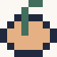

import MultiLanguage, {Page} from '@site/src/components/MultiLanguage';

# Placing the Fruit

A freely moving snake is nice. But it get's a bit dull if that's all there is. To make it a bit more of a challenge, you'd need to add something to change the snake. The classic approach is to let the snake "eat" fruits. That's a good place to start.

<MultiLanguage>

<Page value="assemblyscript">
To place (and eat) a fruit, you first need to make a variable for this. Since it's simply a point on the grid, `Point` will do:

```typescript {2}
const snake = new Snake()
let fruit: Point
let prevState: u8
let frameCount = 0
```

</Page>

<Page value="c">

// TODO

</Page>

<Page value="d">

// TODO

</Page>

<Page value="go">

To place (and eat) a fruit, you first need to make a variable for this. Since it's simply a point on the grid, `Point` will do:

```go {3}
	frameCount = 0
	prevState  uint8
	fruit      Point
```

</Page>

<Page value="nelua">
To place (and eat) a fruit, you first need to make a variable for this. Since it's simply a point on the grid, `Point` will do.

```lua {6}
require "wasm4"
local Snake = require "snake"
local Point, Snake = Snake.Point, Snake.Snake

local snake = Snake.init()
local fruit: Point
local frame_count = 0
local prev_state = 0
```

</Page>

<Page value="nim">

// TODO

</Page>

<Page value="odin">

// TODO

</Page>

<Page value="rust">

To place (and eat) a fruit, you first need to define it in `Game`. Since it's simply a point on the grid, `Point` will do:

```rust {8,16}
// src/game.rs
use crate::snake::{Point, Snake};
use crate::wasm4;

pub struct Game {
    snake: Snake,
    frame_count: u32,
    fruit: Point,
}

impl Game {
    pub fn new() -> Self {
        Self {
            snake: Snake::new(),
            frame_count: 0,
            fruit: Point { x: 0, y: 0 },
        }
    }
}
```

</Page>

<Page value="zig">
To place (and eat) a fruit, you first need to make a variable for this. Since it's simply a point on the grid, `Point` will do. Set it to undefined for now:

```zig {3,6}
const w4 = @import("wasm4.zig");
const Snake = @import("snake.zig").Snake;
const Point = @import("snake.zig").Point;

var snake = Snake.init();
var fruit: Point = undefined;
var frame_count: u32 = 0;
var prev_state: u8 = 0;
```

</Page>

</MultiLanguage>

## Random Numbers

<MultiLanguage>

<Page value="assemblyscript">

AssemblyScript provides us with the `Math.random` function. It returns a floating point value between `0` and `0.999999999`. But since we only deal with integer values, it's a good idea to create a helper function:

```typescript
function rnd(n: i32 = 20): u16 {
    return u16(Math.floor(Math.random() * n))
}
```

This allows you to call `rnd(20)` to get a number between `0` and `19`. Now you can change the fruit declaration:

```typescript {2}
const snake = new Snake()
const fruit = new Point(rnd(20), rnd(20))
let prevState: u8
let frameCount = 0
```

</Page>

<Page value="c">

// TODO

</Page>

<Page value="d">

// TODO

</Page>

<Page value="go">

Go provides us with pretty much everything we could need to create random numbers. The package `math/rand` contains a handy function: `Intn(n int) int`. It takes an integer and returns a random value between 0 and n-1. If you think, placing something like this in `start` would be a good idea:

```go
	fruit.X = rand(20)
	fruit.Y = rand(20)
```

You'd be surprised that this pretty much crashes. So we can't use the standard random-functions of Go? No, we can. We just have to make our own instance of the number generator:

```go {4}
	frameCount = 0
	prevState  uint8
	fruit      Point
	rnd        func(int) int
```

Now you can use it like this:
```go
	rnd = rand.New(rand.NewSource(1)).Intn
	fruit.X = rnd(20)
	fruit.Y = rnd(20)
```

The `1` is the seed. But having a fixed seed is not a good idea. You might be tempted to use `time.Now().Unix()`. But this will crash the came with a nice `field 'runtime.ticks' is not a Function`.

Since the standard `time` is not an option, how about you use something that is time related and is already in your project? Like `frameCount`?

```go
	rnd = rand.New(rand.NewSource(int64(frameCount))).Intn
	fruit.X = rnd(20)
	fruit.Y = rnd(20)
```

Works. But since this is the `start`-function, `frameCount` is pretty much always `0`. That's why here's a small exercise for you: change the seed after the first key was pressed.

:::tip Check the for nil
Keep in mind, that the value of `rnd` is `nil` if it wasn't initialized yet.
:::

</Page>

<Page value="nelua">

Nelua provides us a `math` library with a `random` function, which when called with two integers `m` and `n` it returns a pseudo-random integer with uniform distribution in the range [`m`, `n`].
This allows you to call `math.random(0, 19)` to get a number between `0` and `19`. Now you can change the fruit declaration:

```lua {1, 4}
local math = require 'math'

local snake = Snake.init()
local fruit: Point = { x = math.random(0, 19), y = math.random(0,19) }
local frame_count = 0
local prev_state = 0
```

</Page>

<Page value="nim">

// TODO

</Page>

<Page value="odin">

// TODO

</Page>

<Page value="rust">

There are several random random generators available on [crates.io](https://crates.io), including some that are cryptographically secure.

We don't need anything our snake game to be cryptographically secure so we'll use [`fastrand`](https://crates.io/crates/fastrand) crate:

it provides [`fastrand::Rng`](https://docs.rs/fastrand/1.6.0/fastrand/), a simple seedable pseudo-random number generator.

Let's add `fastrand` to `Cargo.toml`:

```toml {4}
[dependencies]
buddy-alloc = { version = "0.4.1", optional = true }
lazy_static = "1.4.0"
fastrand = "1.6.0"
```

We'll then store an instance of `fastrand::Rng` in our `Game` and initialize fruit coordinates with
[Rng::i32](https://docs.rs/fastrand/1.6.0/fastrand/struct.Rng.html#method.i32):

a method that returns a random `i32` number within the input range.

```rust {7,15,22-23,25}
// src/game.rs
use crate::snake::{Point, Snake};
use crate::wasm4;
use fastrand::Rng;

pub struct Game {
    rng: Rng,
    snake: Snake,
    frame_count: u32,
    fruit: Point,
}

impl Game {
    pub fn new() -> Self {
        let rng = Rng::with_seed(235);

        Self {
            frame_count: 0,
            snake: Snake::new(),
            prev_gamepad: 0,
            fruit: Point {
                x: rng.i32(0..20),
                y: rng.i32(0..20),
            },
            rng,
        }
    }
}
```


</Page>

<Page value="zig">

Zig's standard library has a couple of different random number generators, including some that are meant to be cryptographically secure. We don't need anything our snake game to be cryptographically secure, so we'll just use `std.rand.DefaultPrng`, where Prng means pseudo-random number generator. To start, we'll need to import `std` and initialize the prng:

```zig {2,10-11,20-21}
const w4 = @import("wasm4.zig");
const std = @import("std");
const Snake = @import("snake.zig").Snake;
const Point = @import("snake.zig").Point;

var snake = Snake.init();
var fruit: Point = undefined;
var frame_count: u32 = 0;
var prev_state: u8 = 0;
var prng: std.rand.DefaultPrng = undefined;
var random: std.rand.Random = undefined;

export fn start() void {
    w4.PALETTE.* = .{
        0xfbf7f3,
        0xe5b083,
        0x426e5d,
        0x20283d,
    };
    prng = std.rand.DefaultPrng.init(0);
    random = prng.random();
}

```

We can call `random.intRangeLessThan(T, at_least, less_than)` to get a number between `at_least` and `less_than`, with the type of `T`. You can wrap that in a helper function if you'd like:

```zig
fn rnd(max: i32) i32 {
    return random.intRangeLessThan(i32, 0, max);
}
```

Now use it for the location of the fruit:

```zig {10}
export fn start() void {
    w4.PALETTE.* = .{
        0xfbf7f3,
        0xe5b083,
        0x426e5d,
        0x20283d,
    };
    prng = std.rand.DefaultPrng.init(0);
    random = prng.random();
    fruit = Point.init(rnd(20), rnd(20));
}
```

</Page>

</MultiLanguage>

## Importing PNG Files


Importing images in WASM-4 works a bit different compared to other game engines and Fantasy Consoles. Images have to meet certain criteria:

- PNG only
- Index only
- 4 colors max

Indexed PNG files can be created by several image apps like [Aseprite](https://www.aseprite.org/) or [GIMP](https://www.gimp.org/).

The image we import is a 8x8 PNG file with exactly 4 colors:


This image is zoomed by 800%.


This is the original image. You can download it to proceed.

<MultiLanguage>

<Page value="assemblyscript">

Now you need to import the image. For this, the WASM-4 CLI tool `w4` comes with another tool: `png2src`. You can use it like this:

`w4 png2src --assemblyscript fruit.png`

This will output the following content in the terminal:

```typescript
const fruitWidth = 8;
const fruitHeight = 8;
const fruitFlags = 1; // BLIT_2BPP
const fruit = memory.data<u8>([ 0x00,0xa0,0x02,0x00,0x0e,0xf0,0x36,0x5c,0xd6,0x57,0xd5,0x57,0x35,0x5c,0x0f,0xf0 ]);
```

To get it into a an existing file, use the `>>` operator. Like this:

`w4 png2src --assemblyscript fruit.png >> main.ts`

This will add the previous lines to your `main.ts` and causes an error because "fruit" already exists. Just rename the new fruit to `fruitSprite` and move it somewhere else. Also: You can remove the other stuff added, you won't need it for this project:

```typescript {2}
const snake = new Snake()
const fruit = new Point(rnd(20), rnd(20))
let frameCount = 0
let prevState: u8
const fruitSprite = memory.data<u8>([ 0x00,0xa0,0x02,0x00,0x0e,0xf0,0x36,0x5c,0xd6,0x57,0xd5,0x57,0x35,0x5c,0x0f,0xf0 ])
```

With that out of the way, it's time to actually render the newly imported sprite.

</Page>

<Page value="c">

// TODO

</Page>

<Page value="d">

// TODO

</Page>

<Page value="go">

Now you need to import the image. For this, the WASM-4 CLI tool `w4` comes with another tool: `png2src`. You can use it like this:

`w4 png2src --go fruit.png`

This will output the following content in the terminal:

```go
const fruitWidth = 8
const fruitHeight = 8
const fruitFlags = 1 // BLIT_2BPP
var fruit = [16]byte { 0x00,0xa0,0x02,0x00,0x0e,0xf0,0x36,0x5c,0xd6,0x57,0xd5,0x57,0x35,0x5c,0x0f,0xf0 }
```

To get it into a an existing file, use the `>>` operator. Like this:

`w4 png2src --go fruit.png >> main.go`

This will add the previous lines to your `main.go` and causes an error because "fruit" already exists. Just rename the new fruit to `fruitSprite` and move it somewhere else. Also: You can remove the other stuff added, you won't need it for this project:

```go {5}
	frameCount  = 0
	prevState   uint8
	fruit       Point
	rnd         func(int) int
	fruitSprite = [16]byte{0x00, 0xa0, 0x02, 0x00, 0x0e, 0xf0, 0x36, 0x5c, 0xd6, 0x57, 0xd5, 0x57, 0x35, 0x5c, 0x0f, 0xf0}
```

With that out of the way, it's time to actually render the newly imported sprite.

</Page>

<Page value="nelua">

Now you need to import the image. For this, the WASM-4 CLI tool `w4` comes with another tool: `png2src`. You can use it like this:

`w4 png2src --nelua fruit.png`

This will output the following content in the terminal:

```lua
-- fruit
local fruit_width <comptime> = 8
local fruit_height <comptime> = 8
local fruit_flags <comptime> = 1 -- BLIT_2BPP
local fruit: [16]uint8 = { 0x00,0xa0,0x02,0x00,0x0e,0xf0,0x36,0x5c,0xd6,0x57,0xd5,0x57,0x35,0x5c,0x0f,0xf0 }
```

To get it into a an existing file, use the `>>` operator. Like this:

`w4 png2src --nelua fruit.png >> main.nelua`

This will add the previous lines to your `main.nelua` and it will shadow the previous `fruit` variable. Just rename the new fruit to `fruit_sprite` and move it somewhere else. Also: You can remove the other stuff added, you won't need it for this project:

```lua {5}
local snake = Snake.init()
local fruit: Point = { x = math.random(0, 19), y = math.random(0,19) }
local frame_count = 0
local prev_state = 0
local fruit_sprite: [16]uint8 = { 0x00,0xa0,0x02,0x00,0x0e,0xf0,0x36,0x5c,0xd6,0x57,0xd5,0x57,0x35,0x5c,0x0f,0xf0 }
```

With that out of the way, it's time to actually render the newly imported sprite.

</Page>

<Page value="nim">

// TODO

</Page>

<Page value="odin">

// TODO

</Page>

<Page value="rust">

Now you need to import the image. For this, the WASM-4 CLI tool `w4` comes with another tool: `png2src`. You can use it like this:

```bash
w4 png2src --rust fruit.png
```


This will output the following content in the terminal:

```rust
const FRUIT_WIDTH: u32 = 8;
const FRUIT_HEIGHT: u32 = 8;
const FRUIT_FLAGS: u32 = 1; // BLIT_2BPP
const FRUIT: [u8; 16] = [ 0x00,0xa0,0x02,0x00,0x0e,0xf0,0x36,0x5c,0xd6,0x57,0xd5,0x57,0x35,0x5c,0x0f,0xf0 ];
```

Let's copy `FRUIT` and add it to our project;
we'll also rename it `FRUIT_SPRITE`.

```rust {6-8}
// src/game.rs
use crate::snake::{Point, Snake};
use crate::wasm4;
use fastrand::Rng;

const FRUIT_SPRITE: [u8; 16] = [
    0x00, 0xa0, 0x02, 0x00, 0x0e, 0xf0, 0x36, 0x5c, 0xd6, 0x57, 0xd5, 0x57, 0x35, 0x5c, 0x0f, 0xf0,
];

pub struct Game {
    rng: Rng,
    snake: Snake,
    frame_count: u32,
    fruit: Point,
}
```

</Page>

<Page value="zig">

Now you need to import the image. For this, the WASM-4 CLI tool `w4` comes with another tool: `png2src`. You can use it like this:

`w4 png2src --zig fruit.png`

This will output the following content in the terminal:

```zig
const fruit_width = 8;
const fruit_height = 8;
const fruit_flags = 1; // BLIT_2BPP
const fruit = [16]u8{ 0x00,0xa0,0x02,0x00,0x0e,0xf0,0x36,0x5c,0xd6,0x57,0xd5,0x57,0x35,0x5c,0x0f,0xf0 };
```

To get it into a an existing file, use the `>>` operator (or copy and paste). Like this:

`w4 png2src --zig fruit.png >> main.zig`

This will add the previous lines to your `main.zig` and causes an error because "fruit" already exists. Just rename the new fruit to `fruitSprite` and move it somewhere else. Also: You can remove the other stuff added, you won't need it for this project:

```zig {6}
var snake = Snake.init();
var fruit: Point = undefined;
var frame_count: u32 = 0;
var prev_state: u8 = 0;
var random: std.rand.Random = undefined;
const fruit_sprite = [16]u8{ 0x00,0xa0,0x02,0x00,0x0e,0xf0,0x36,0x5c,0xd6,0x57,0xd5,0x57,0x35,0x5c,0x0f,0xf0 };
```

With that out of the way, it's time to actually render the newly imported sprite.

</Page>

</MultiLanguage>

## Rendering a PNG File

<MultiLanguage>

<Page value="assemblyscript">

Rendering the sprite is rather simple. Just call the `blit` function of w4:

```typescript
// Blit draws a sprite at position `x`, `y` and uses DRAW_COLORS accordingly
function blit(spritePtr: usize, x: i32, y: i32, width: u32, height: u32, flags: u32): void;
```

In practice it looks like this:

```typescript
export function update(): void {
    frameCount++

    input()

    if (frameCount % 15 == 0) {
        snake.update()
    }
    snake.draw()

    w4.blit(fruitSprite, fruit.x * 8, fruit.y * 8, 8, 8, w4.BLIT_2BPP)
}
```

But since you set the drawing colors, you need to change the drawing colors too:

```typescript {3}
    snaked.draw()

    store<u16>(w4.DRAW_COLORS, 0x4320)
    w4.blit(fruitSprite, fruit.x * 8, fruit.y * 8, 8, 8, w4.BLIT_2BPP)
```

This way, w4 uses the color palette in its default configuration. Except for one thing: The background will be transparent.

</Page>

<Page value="c">

// TODO

</Page>

<Page value="d">

// TODO

</Page>

<Page value="go">

Rendering the sprite is rather simple. Just call the `Blit` function of w4:

```go
// Blit draws a sprite at position X, Y and uses DRAW_COLORS accordingly
func Blit(sprite *byte, x, y int, width, height, flags uint)
```

In practice it looks like this:

```go {13}
//go:export update
func update() {
	frameCount++

	input()

	if frameCount%15 == 0 {
		snake.Update()
	}

	snake.Draw()

	w4.Blit(&fruitSprite[0], fruit.X*8, fruit.Y*8, 8, 8, w4.BLIT_2BPP)
}
```

But since you set the drawing colors, you need to change the drawing colors too:

```go {3}
	snake.Draw()

	*w4.DRAW_COLORS = 0x4320
	w4.Blit(&fruitSprite[0], fruit.X*8, fruit.Y*8, 8, 8, w4.BLIT_2BPP)
```

This way, w4 uses the color palette in its default configuration. Except for one thing: The background will be transparent.

</Page>

<Page value="nelua">

Rendering the sprite is rather simple. Just call the `blit` function of w4:

```lua
// Blit draws a sprite at position `x`, `y` and uses DRAW_COLORS accordingly
global function blit(data: *[0]uint8, x: int32, y: int32, width: uint32, height: uint32, flags: uint32)
```

In practice it looks like this:

```lua {12}
local function update()
  frame_count = frame_count + 1

  input()

  if frame_count % 15 == 0 then
    snake:update()
  end

  snake:draw()

  blit(fruit_sprite, fruit.x * 8, fruit.y * 8, 8, 8, BLIT_2BPP)
end
```

But since you set the drawing colors, you need to change the drawing colors too:

```lua {3}
  snake:draw()

  $DRAW_COLORS = 0x4320
  blit(fruit_sprite, fruit.x * 8, fruit.y * 8, 8, 8, BLIT_2BPP)
```

This way, w4 uses the color palette in its default configuration. Except for one thing: The background will be transparent.

</Page>

<Page value="nim">

// TODO

</Page>

<Page value="odin">

// TODO

</Page>

<Page value="rust">

Rendering the sprite is rather simple. Just call the blit function of w4:

```rust
pub fn blit(sprite: &[u8], x: i32, y: i32, width: u32, height: u32, flags: u32);
```

In practice it looks like this:

```rust {10-17}
// src/game.rs inside impl Game {} block
    pub fn update(&mut self) {
        self.frame_count += 1;

        if self.frame_count % 15 == 0 {
            self.snake.update();
        }
        self.snake.draw();

        wasm4::blit(
            &FRUIT_SPRITE,
            self.fruit.x * 8,
            self.fruit.y * 8,
            8,
            8,
            wasm4::BLIT_2BPP,
        );
    }
```

But since you set the drawing colors, you need to change the drawing colors too:

```rust {10}
// src/game.rs inside impl Game {} block
    pub fn update(&mut self) {
        self.frame_count += 1;

        if self.frame_count % 15 == 0 {
            self.snake.update();
        }
        self.snake.draw();

        set_draw_color(0x4320);
        wasm4::blit(
            &FRUIT_SPRITE,
            self.fruit.x * 8,
            self.fruit.y * 8,
            8,
            8,
            wasm4::BLIT_2BPP,
        );
    }
```

This way, w4 uses the color palette in its default configuration. Except for one thing: The background will be transparent.

</Page>

<Page value="zig">

Rendering the sprite is rather simple. Just call the `blit` function of w4:

```zig
/// Copies pixels to the framebuffer.
pub extern fn blit(sprite: [*]const u8, x: i32, y: i32, width: i32, height: i32, flags: u32) void;
```

In practice it looks like this:

```zig {11}
export fn update() void {
    frame_count += 1;

    input();

    if (frame_count % 15 == 0) {
        snake.update();
    }
    snake.draw();

    w4.blit(&fruit_sprite, fruit.x * 8, fruit.y * 8, 8, 8, w4.BLIT_2BPP);
}
```

But since you set the drawing colors, you need to change the drawing colors too:

```zig {3}
    snake.draw();

    w4.DRAW_COLORS.* = 0x4320;
    w4.blit(&fruit_sprite, fruit.x * 8, fruit.y * 8, 8, 8, w4.BLIT_2BPP);
```

This way, w4 uses the color palette in its default configuration. Except for one thing: The background will be transparent.

</Page>

</MultiLanguage>
