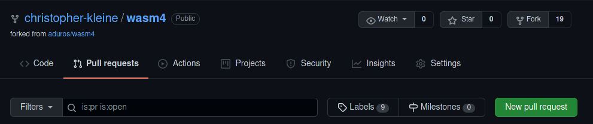

import Tabs from '@theme/Tabs';
import TabItem from '@theme/TabItem';

# Publish Your Game

## Create a Publish Version

You need a version of your game that you can publish. You'll also need a cover-image.

While your game runs in the browser, press `F9` on your keyboard. This will generate a screenshot in PNG format. You can use this as a cover-image.

Now let's compile your game.

<Tabs
    groupId="code-language"
    defaultValue="language-typescript"
    values={[
        {label: 'AssemblyScript', value: 'language-typescript'},
        {label: 'C / C++', value: 'language-cpp'},
        {label: 'Rust', value: 'language-rust'},
        {label: 'Go', value: 'language-go'},
    ]}>

<TabItem value="language-typescript">

```shell
npm run build
```

Your game will be here: `build/cart.wasm`

</TabItem>

<TabItem value="language-cpp">

```shell
make
```

Your game will be here: `build/cart.wasm`

</TabItem>

<TabItem value="language-rust">

```shell
cargo build --release
```

Your game will be here: `target/wasm32-unknown-unknown/release/cart.wasm`

</TabItem>

<TabItem value="language-go">

```shell
make
```

Your game will be here: `build/cart.wasm`

</TabItem>

</Tabs>

## Your Account

:::note Early version
The WASM-4 project is still in it's early stages. The process of submitting your game onto the website is still not finished and a little rough around the edges.
:::

WASM-4 and it's website are stored in a Git-Repo (short for Repository) hosted on GitHub.

To publish your game, you *need* a GitHub Account. If you don't have one already, [create one](https://github.com/join). In case you already have one, [login](https://github.com/login).

## Forking the Repo

Now you need to "fork" the repo. For this, go to the [original GitHub Repo of WASM-4](https://github.com/aduros/wasm4).

At the top you will find some "actions" you can take: `Watch/Unwatch`, `Star/Unstar`, `Fork`. The last one is what you're looking for.

## Uploading Your Game

Once you've forked the repo, visit your version and navigate to the folder `site/static/carts/`. There you can upload your cart.wasm and a 160x160 cover-image of the game. A screenshot is an easy way. Simply press F9 while your game is running.

Also: Rename your cart.wasm to something meaningful. Like `snake-spartan-edition.wasm`. Your screenshot should have the same name (but a different extension like `snake-spartan-edition.png`).

Commit the changes and you're done with this folder.

## Changing the List of Games

Now that your game and the cover-image are uploaded, it's time to add them to the list of games. Navigate to `site/` and open the file `cart.js`.

Press the `Edit` button (a pen) at the top. Now you can edit the file directly in the browser. Copy and Paste one of the entries and change the values to fit your specifications.

Here is what each property is used for:

| Property | Description |
|----------|-------------|
| slug     | Displayed in the address bar. A `lakeshooter` will result in this: https://wasm4.org/play/lakeshooter a `pong` would result in https://wasm4.org/play/pong |
| title    | This is the name displayed on the collection. |
| author   | The name displayed by WASM-4.  |
| github   | Your GitHub username. This is used to display your avatar on the cover-page. |

Once you've done this, commit those changes too.

## Letting WASM-4 Know

Your fork is now ready. Switch to the `Pull Requests` tab and press on "New pull request".



Add some comment if you want. And then press "Make pull request" at the bottom. You're done!

## Wait a Bit

Since this procedure is currently involving the interaction of humans, your PR (short for Pull Request) needs to be verified by an authorized person such as `aduros`. Your PR will also cause a notification in our discord channel to let him know sooner rather than later.

And once he approved your PR, another notification will be send to our discord channel.

## Discord!

If you have questions or if you don't want to miss when your game is added (or simply want to talk to a bunch of nice people), [join us on our discord channel](https://discord.gg/E8wqqMFW).
